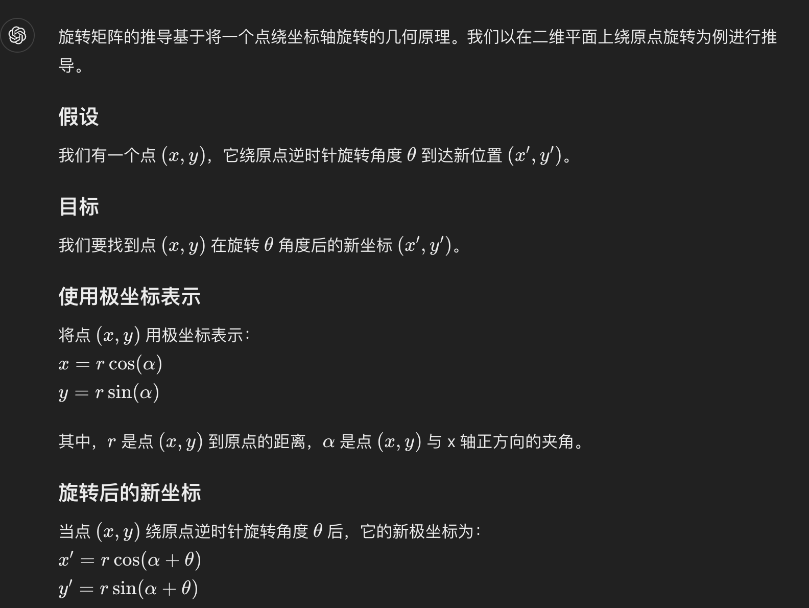
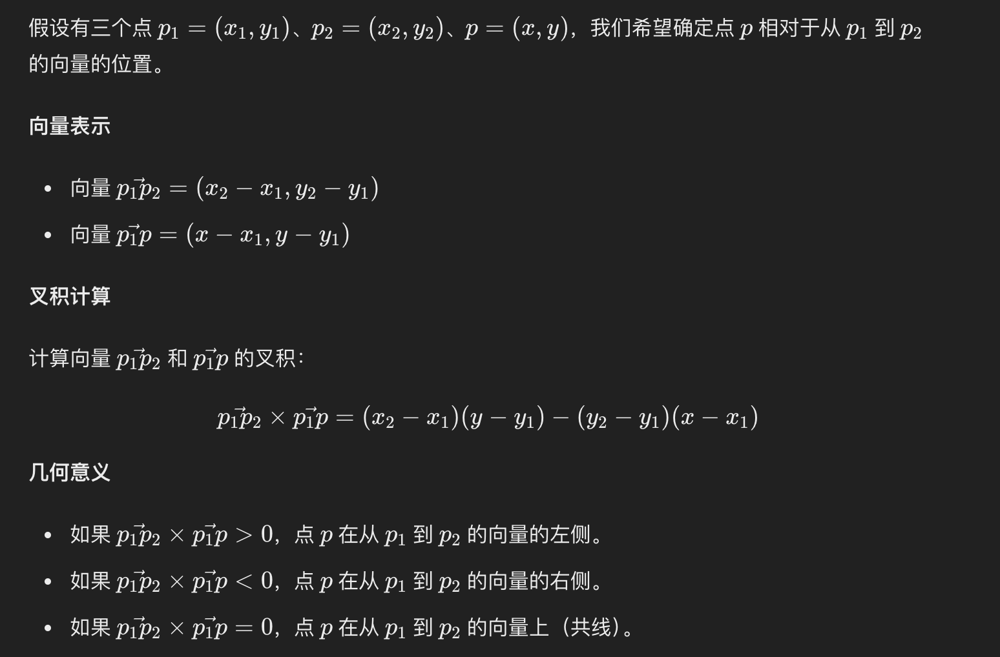
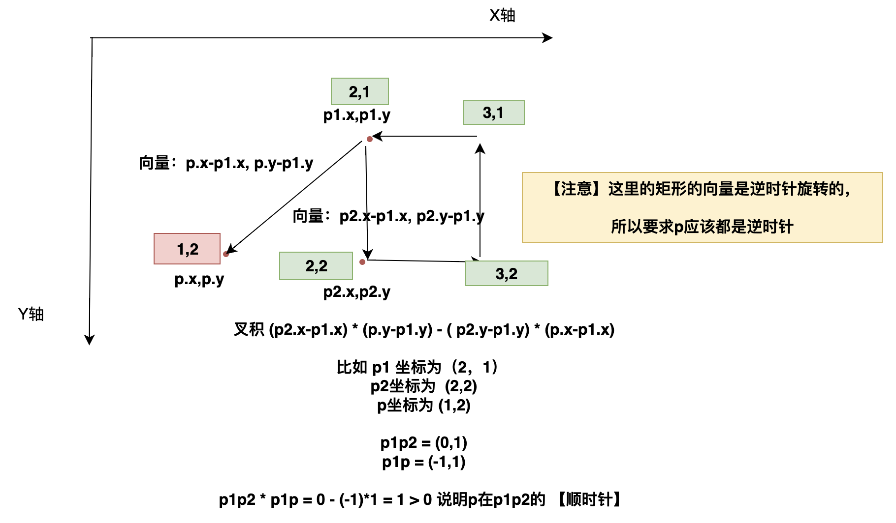
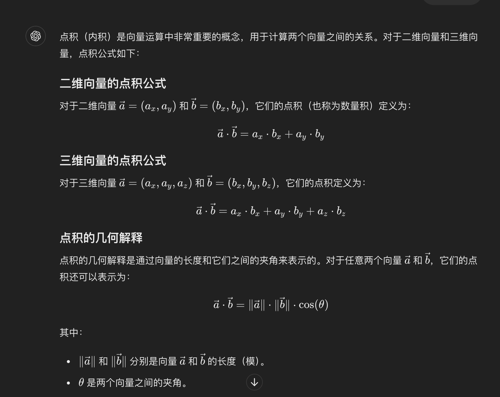
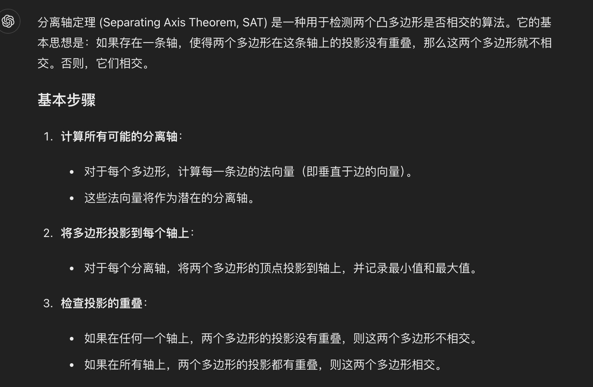
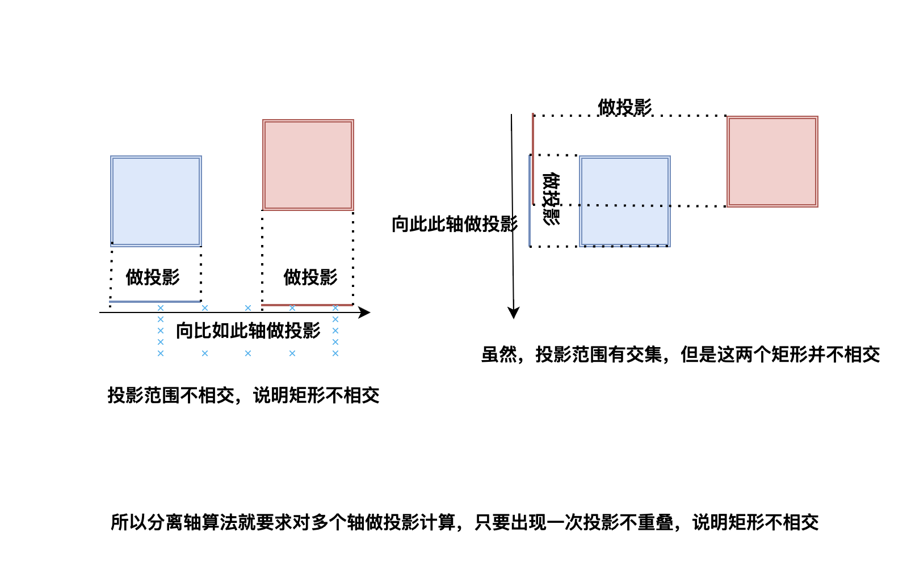

# Golang 实现小游戏


项目地址: https://github.com/gofish2020/tankgame 欢迎Fork && Star


## 游戏效果
本项目基于游戏引擎 `Ebitengine` 开发，这里有很多的实例 https://ebiten-zh.vercel.app/examples/ 便于边学边用


## 代码结构

```go
tankgame
├── go.mod
├── go.sum
├── main.go 入口函数
├── package
│   ├── game
│   │   └── game.go 基于全局参数，游戏进度逻辑处理
│   ├── monitor
│   │   └── screen.go 显示器的宽+高获取
│   ├── tank
│   │   ├── barrier.go 障碍物的创建 + 绘制
│   │   ├── check.go   碰撞检测
│   │   ├── gameover.go 游戏结束画面
│   │   ├── keyboard.go 坦克周围字体绘制
│   │   ├── menu.go  游戏开始界面
│   │   ├── npcmove.go npc的移动 + 敌人搜索
│   │   ├── name.go  坦克的名字
│   │   └── tank.go  每个坦克的绘制 + 逻辑处理
│   └── utils
│       ├── sound      
│       │   ├── sound.go 音频处理
│       ├── utils.go 扇形绘制
│       └── variable.go  全局参数（控制游戏进度）
├── resource 图片资源


```

代码中有大量注释，直接看代码即可


## 数学知识补充

**旋转矩阵**
用来计算坐标点经过旋转后的新的坐标




**叉积公式**

可以用来判断点是否在多边形内部；

代码的中的坐标是向下为Y轴，向右为X轴，所以这里的左边（逆时针），变成顺时针；这里的右边（顺时针），变成了逆时针。






**点积公式**

用来做向量投影计算



**分离轴定理**
用来做矩形是否相交的算法

找多边形的每条边的法向量（然后作为轴），让每个多边形的顶点向量（计算点积）向轴进行投影；判断投影是否有重叠。。只要出现一个不重叠的轴，就说明多边形不相交


